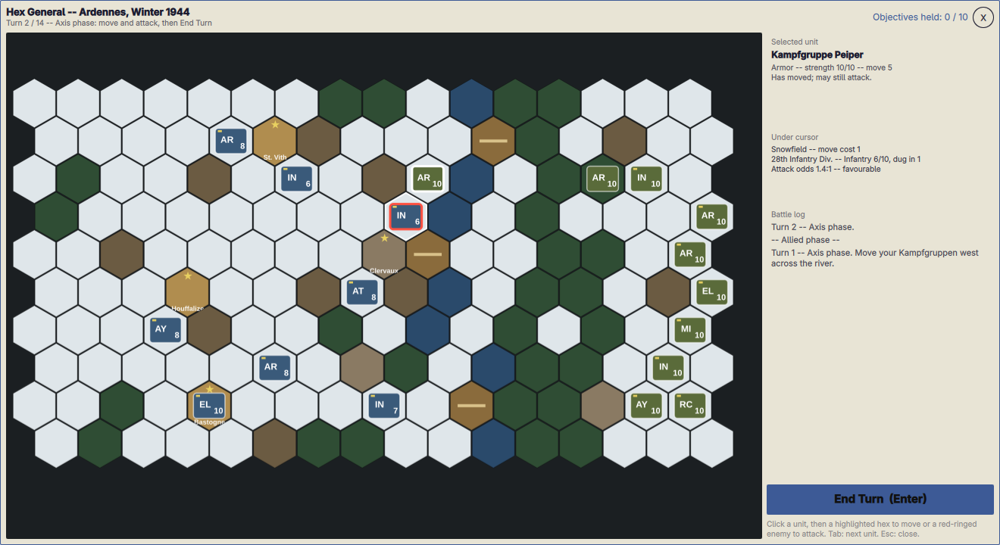

# Hex General

A hex-grid, turn-based WWII operational wargame for
[Omarchy](https://omarchy.org/), in the spirit of the classic 1990s
*Panzer General*. It opens as a full-screen panel over your desktop; play a
few turns, close it, and the battle waits for you.

Rather than the whole campaign, Hex General is about single battles. It
ships with one scenario: **Ardennes, Winter 1944** -- the opening of the
Battle of the Bulge. You command the Axis Kampfgruppen on the east edge and
have 14 turns to cross the Our/Clerf river line and hold the objective towns
(St. Vith, Clervaux, Houffalize, Bastogne) while Allied reinforcements pour
in from the west.



## Install

```
omarchy plugin add https://github.com/eddygarcas/omarchy-hex-general.git --enable
```

Or manually:

```
git clone https://github.com/eddygarcas/omarchy-hex-general.git \
  ~/.config/omarchy/plugins/eduard.hex-general
omarchy-shell shell rescanPlugins
omarchy plugin enable eduard.hex-general
```

## Open it

```
omarchy-shell shell toggle eduard.hex-general
```

Bind that to a key in `~/.config/hypr/bindings.lua`:

```lua
o.bind("SUPER + SHIFT + H", "Hex General", "omarchy-shell shell toggle eduard.hex-general")
```

or add a row to `~/.config/omarchy/extensions/omarchy-menu.jsonc`:

```jsonc
"hex-general": {"icon":"󰊗","label":"Hex General","action":"omarchy-shell shell toggle eduard.hex-general"}
```

## How to play

Each turn you move and attack with every Axis unit, then press **End Turn**.
The Allied side then plays its turn in front of you, one unit at a time --
each counter slides along its move and every shot is shown as a tracer and
an explosion -- before play returns to you.

- **Click a unit** to select it. Hexes it can reach are highlighted; enemies
  it can attack get a red ring. **Tab** cycles through units that can still
  act.
- **Click a highlighted hex** to move there. Terrain costs movement points
  (snowfield 1, forest/hills 2, roads always 1, rivers are impassable
  except at bridges), and entering an enemy **zone of control** (any hex
  next to an enemy) ends the move.
- **Objective towns** (yellow ring) fly the flag of whoever moved in last.
  Capturing one keeps it until the enemy takes it back; you do not have to
  garrison it.
- **Click a red-ringed enemy** to attack. Hover it first: the sidebar shows
  the odds. Odds depend on attacker type vs. hard/soft target, both units'
  strength, the defender's terrain and how long it has been dug in. Units
  that sit still entrench (up to three levels, shown as gold pips).
- **Artillery** fires from up to three hexes away and takes no return fire.
- **Overrun**: a unit that has not moved yet and destroys an adjacent enemy
  may still advance, with half its movement points, to exploit the gap.
- **Replacements**: a damaged unit that spends a whole turn without moving
  or firing regains one step of strength at the end of it -- as long as it
  can trace a supply line to its own map edge through hexes free of enemy
  units and enemy zones of control (friendly-held hexes count as open).
  A unit that is **cut off** gets a red marker and recovers nothing until
  the pocket is opened again.
- **Movement arrows**: every move of the battle is drawn campaign-map
  style -- red arrows for the Axis, blue for the Allies -- so you can read
  the whole offensive at a glance. Press **M** to hide or show them.
- **Enter** / **Space** ends the turn. **N** starts a new game. **Esc** or a
  click outside the board closes the panel without losing the game.

Victory is scored on objective points held when the turn limit runs out
(or earlier, if you take every town or lose every unit).

## Remove

```
omarchy plugin remove eduard.hex-general
```

The plugin keeps no files and starts no processes; game state is in-memory
only and resets when the shell restarts.

## License

MIT -- see [LICENSE](LICENSE).
